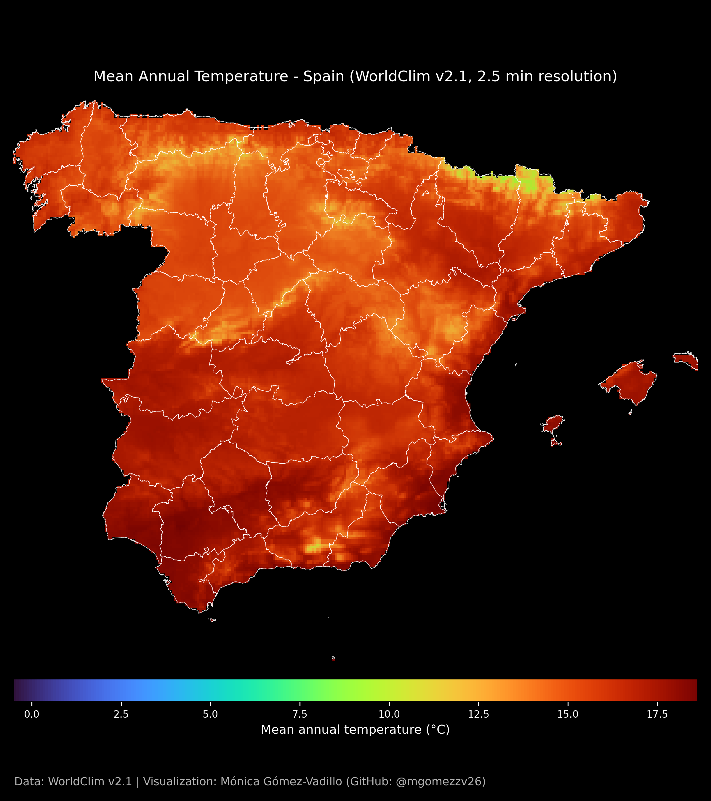

```{r setup, include=FALSE}
knitr::opts_chunk$set(echo = TRUE)
```

## 30 Day Map Challenge - 03_Polygons

### Day callenge description

Challenge Classic: Create a map focused on area features (e.g., administrative regions, land use, boundaries). Use fills, patterns, and choropleth techniques.

### Something about the map!

Mean Annual Temperature - Spain (WorldClim v2.1, 2.5 min resolution)
This map shows the mean annual temperature (BIO1 variable) across Spanish provinces, using bioclimatic data from WorldClim v2.1.
The map combines administrative boundaries from the Instituto Geográfico Nacional (IGN) with high-resolution climate raster data to illustrate spatial temperature gradients across the Iberian Peninsula.

**Technical note:**  

This map was created using **Python** in a Jupyter Notebook.  
The full code used to generate the figure can be found in the accompanying file:  
➡️ `03_Polygons.ipynb`

```{r mapa_antiguo, echo=FALSE, out.width='100%', fig.cap="Mean Annual Temperature – Spain"}

```

