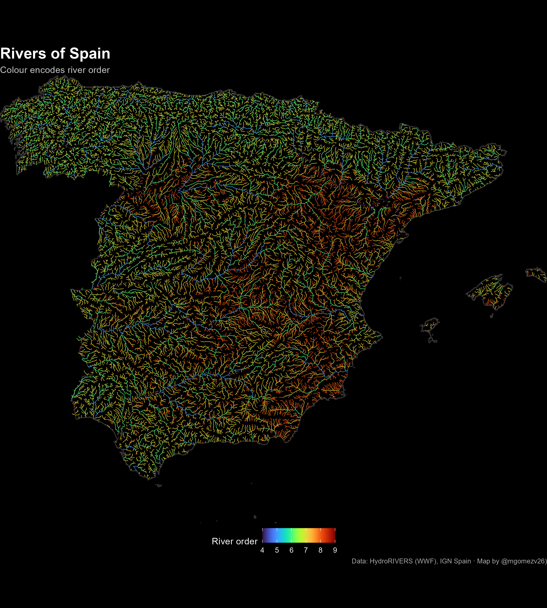

```{r message=FALSE, warning=FALSE}
knitr::opts_chunk$set(echo = TRUE, message = FALSE, warning = FALSE)
```


#  === 30 Day Map Challenge - Day 20 – Water ===

## Day callenge description

Challenge Classic: Classical Elements 4/4: Focus on the fluid. Map hydrology, oceans, currents, water accessibility, sea level rise, precipitation, or anything aquatic.

For the “Water” theme of the 30 Day Map Challenge, this visualization shows the river network of Spain using HydroRIVERS (WWF). The map focuses on the spatial complexity of hydrological systems and the hierarchical structure of rivers according to Strahler order. A dark background combined with a neon colour palette highlights the major drainage pathways while preserving fine-scale tributary detail.


```{r message=FALSE, warning=FALSE}
library(sf)
library(terra)
library(dplyr)
library(ggplot2)
library(viridis)
sf_use_s2(FALSE)

# Show versions for reproducibility
packages <- c("sf", "terra", "dplyr", "ggplot2", "viridis")
versions <- sapply(packages, function(p) as.character(packageVersion(p)))
data.frame(Package = packages, Version = versions)

```

# === 1. España desde IGN  ===

```{r}
esp_prov <- st_read("01_DATA/spain_provinces_IGN.gpkg") |>
  st_make_valid()

esp <- esp_prov |>
  summarise() |>
  st_make_valid()

```

# === 2. Ríos de España (recortados en QGIS) a partir de ríos HydroRIVERS Europa ===

```{r}
rivers_es <- st_read("01_DATA/rivers_spain.gpkg") |>
  st_make_valid()

```

# === 3. Variable de color ===

```{r}
rivers_es <- rivers_es |>
  mutate(color_var = ORD_FLOW)

```

# === 4. Mapa ===

```{r message=FALSE, warning=FALSE}
p <- ggplot() +
  # fondo negro
  geom_rect(
    xmin = -Inf, xmax = Inf, ymin = -Inf, ymax = Inf,
    fill = "black"
  ) +
  # contorno España
  geom_sf(
    data = esp,
    fill  = NA,
    color = "#333333",
    linewidth = 0.5
  ) +
  # ríos coloreados
  geom_sf(
    data = rivers_es,
    aes(color = color_var),
    linewidth = 0.22
  ) +
  scale_color_viridis(
    option = "turbo",   # "inferno", "magma", "turbo", "plasma"
    name   = "River order"
  ) +
  coord_sf(expand = FALSE) +
  theme_void() +
  theme(
    panel.background = element_rect(fill = "black", colour = NA),
    plot.background  = element_rect(fill = "black", colour = NA),
    legend.position  = "bottom",
    legend.title     = element_text(color = "white"),
    legend.text      = element_text(color = "white"),
    plot.title       = element_text(size = 18, face = "bold", colour = "white"),
    plot.subtitle    = element_text(size = 11, colour = "grey80"),
    plot.caption     = element_text(size = 8,  colour = "grey70")
  ) +
  labs(
    title    = "Rivers of Spain",
    subtitle = "Colour encodes river order",
    caption  = "Data: HydroRIVERS (WWF), IGN Spain · Map by @mgomezv26)"
  )

```

# === 5. Exportar ===

```{r}
ggsave("rivers_spain_black_turbo_day20.png",p, width = 9, height = 10, dpi = 300, bg = "black")

```

```{r fig.cap="3D geological map of Asturias", echo=FALSE, out.width='100%'}

```

